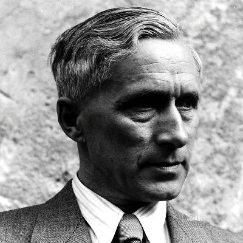

# Hey, I'm Jünger!

I'm actually a physicist. While I used to work on lasers, my current focus is on particle physics and conducting experiments at CERN.
Nowadays, my work consists mostly of cryptography and mathematics rather than physics.

# What I'm interested in?

I follow the cypherpunk philosophy. In my opinion, privacy in the digital era is an essential requirement, not just an option. Therefore, I am committed to utilizing the necessary tools for creating privacy protocols.

